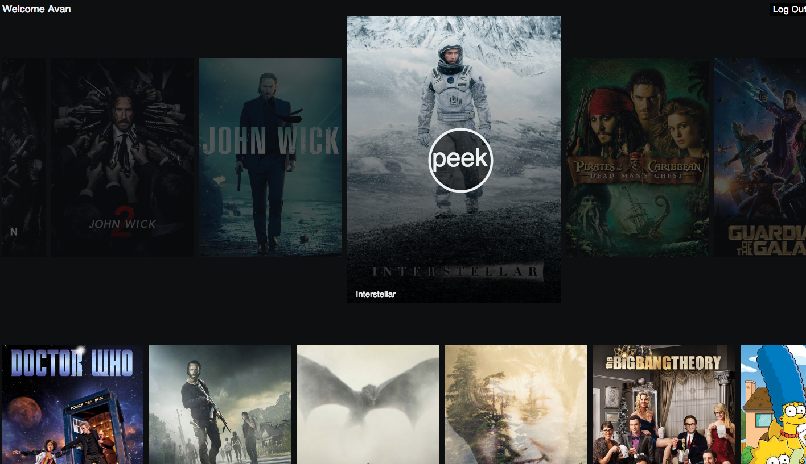
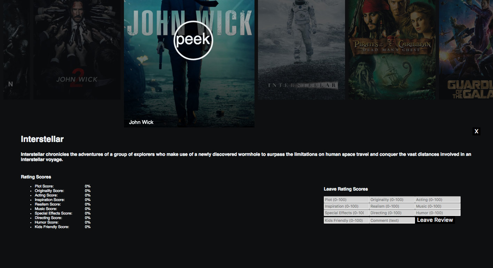
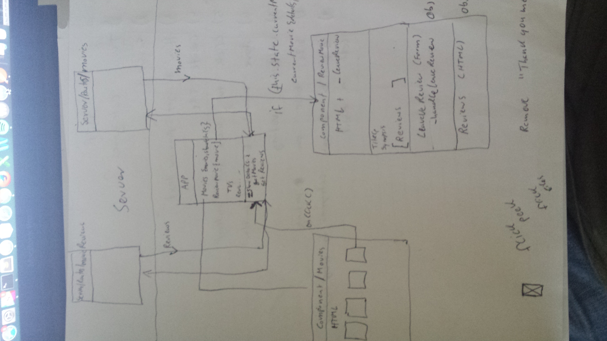

# flick peek 

## Overview

flick peek is a movie and tv series rating app (I know, crazy!). It facilitates a more holistic approach to movie and tv series rating. User can click on a movie or TV series object which are displayed when the app is loaded and then view and rate (if eligible) the item. Currently the app lists a list of popular movies along with a list of popular TV series. Any future versions would include a search feature to allow searching for particular titles.

## Preview

   

## Dependencies and Technologies

The application is built using Node.js with express, mongoDB and React.js. 

The application is connecting to The Movie DB API to retrieve movies and TV series. 

Dependencies: 
  	bcrypt-nodejs,
   body-parser,
   cors,
   dotenv,
   express,
   jsonwebtoken,
   mongoose,
   morgan,
   moviedb
   
## Approach 

My approach to this project was pretty straight-forward. I struggled a little bit identifying an idea for the project that was reasonable, feasible, interesting and allows me to focus on the right technologies for optimal growth in my technical skills. 

I started working on the project on Monday morning which is late compared to my previous projects. My goal was simple, get the MVP up and running ASAP. I did not plan or design anything before hand. While I am a firm believer in design and even test firt approach I did feel it was necessary on this project. I knew I just had to retrieve a set a movie and tv series and then allow each movie to be clicked so more details can be viewed and a set of rating scores can be left for them. 

## Installation Instructions

simply run npm install --save for all the dependencies. Make sure start mongod by typing "mongod" in the terminal. Then in the server side of the app run "nodemon" and on the client side run "npm start".

## Unresolved Issues / Hurdles 

There are a few known unresolved issues such as form data is currently not validated. Comments left by users are not being used in any way. After a user has left a review and clicks on another movie or TV series in the same set the details pane does not get updated correctly. 

Working with react was a challenge. I feel like it requires a slightly different types of mindset compared to some other frameworks or way of programming. 

## User Stories

- As a non-logged in user I shall be able to view a set of movies and TV Series
- As a non-logged in user I shall be able to view the title, synopsis and average rating score in each rating category
- As a logged-in user I shall be able to login
- As a logged-in user I shall be able to log out
- As a logged-in user I shall be able to leave a set of rating scores

## Wireframe

        
   
   